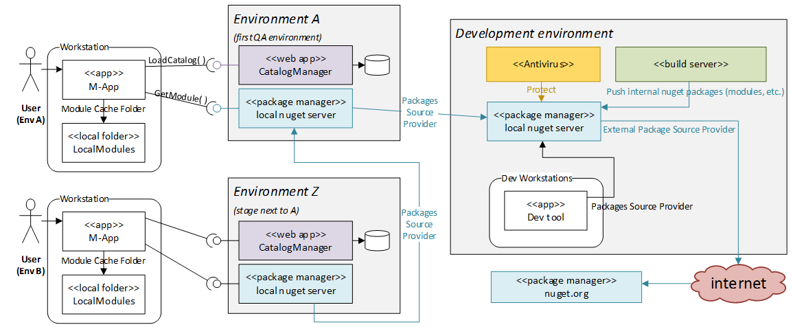
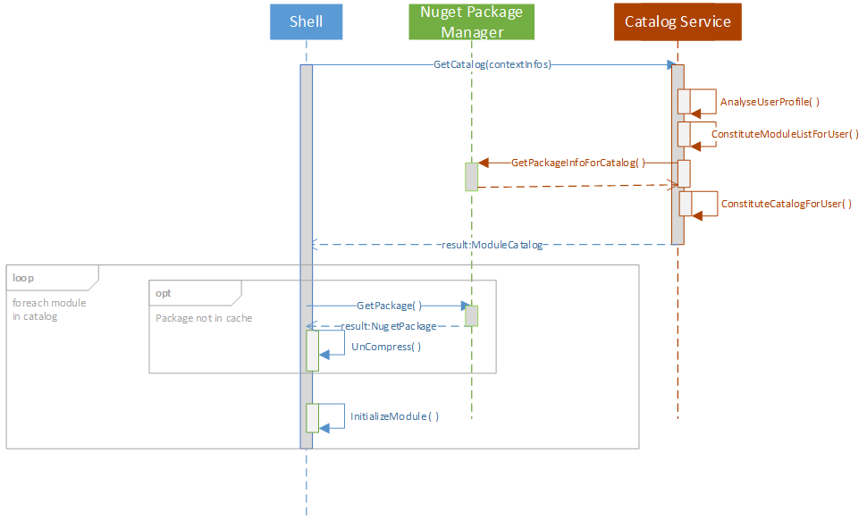

# 1. Application Package Manager - API

<!-- TOC -->

- [1. Application Package Manager - API](#1-application-package-manager---api)
    - [1.1. Process de fonctionnement](#11-process-de-fonctionnement)
    - [1.2. Projets](#12-projets)
    - [1.3. Implémentation Nuget : Nupkg utilisé comme module](#13-implémentation-nuget--nupkg-utilisé-comme-module)
        - [1.3.1. Le package](#131-le-package)
- [Application Package Manager - Usage dans le cadre de Prism](#application-package-manager---usage-dans-le-cadre-de-prism)
    - [Support des nuget dans Prism](#support-des-nuget-dans-prism)
    - [Configuration des ```ModuleInfo```](#configuration-des-moduleinfo)

<!-- /TOC -->

Les applications modulaires ont la particularité d'être constituées d'un exécutable qui charge un ensemble de modules (addins) indépentants.   
Ces modules fonctionnels portent les fonctionnalités proposées à l'utilisateur.  
L'expérience utilisateur proposée est ainsi personnalisée en fonction de l'utilisateur.

Prism propose cette mécanique de modularité. Nativement, Prism ne propose pas d'autres source de repository de binaires que le filesystem.  
L'API AppPackageManager propose de s'appuyer sur un serveur Nuget et son cache local à la machine comme source de repository de binaires.

## 1.1. Process de fonctionnement

L'environnement d'exécution d'application s'appuyant sur ce principe est décrit par le diagramme suivant :


Deux types d'environnements sont explicités :
- Environnement de développement où sont produit les packages (nupkg) qui contiennent les binaires nécessaires à l'exécution du module fonctionnel,
- Environnement d'exécution applicatif ('A', 'Z') dans lequel les composants suivants sont représentés :
  - **CatalogManager** : serveur de configuration cappable de retourner à l'application la liste des modules fonctionnel (et package correspondant).  
  Cette liste est constituée en fonction de l'utilisateur, de la version de l'application, etc.  
  *Ce service peut également être utilisé pour diffuser la configuration à l'application*
  - **Nuget** : Repository de packages au standard Nuget. Ce composant ne contient que des packages embarquant des modules fonctionnels
  - **LocalCache** : Cache local des packages déjà rappatriés.  
  Ceci permet d'éviter de récupérer un package déjà exécuté dans l'application.
  - **M-App** : Application modulaire qui charge dynamiquement les modules fonctionnels en fonction de ce qui lui est indiqué lors de l'appel au service CatalogManager

Le principe de fonctionnement est le suivant :
- L'environnement de développement produit un module RC. Ce module est poussé dans le nuget de modules.
- Le catalogue est mis à jour au sein de l'environnement "A"
- Au démarrage de M-App
 - L'application récupère le catalogue (mis à jour avec la nouvelle version du module)
 - L'application contacte le serveur Nuget pour récupérer le package
   - [Le serveur nuget de l'environnement A ne dispose pas encore du package dans la version indiquée] Il contacte le serveur nuget parent pour récupérer la version (en env dev dans l'exemple)
   - Le serveur retourne le package
 - L'application charge le module (voi la description faite dans le diagramme de séquence ci dessous)

Cette logique est reproductible dans chaque stage du SI de l'entreprise (INT/TEST/PROD) et quel que soit le nombre de stages.

Le diagramme suivant décrit le process de chargement des modules dans une application (shell) utilisant ce principe.  



- L'application principale récupère un catalogue de modules à charger auprès d'un service de catalogues,
- Pour chaque module : (**réalisé par le composant AppPackageManager**)
  - L'application vérifie si le nupkg correspondant au module souhaité est dans le cache local
    - *[Le package est dans le cache local]* Chargement dans l'AppDomain courant
    - *[Le package n'est pas dans le cache local]* Chargement depuis le repository nuget de modules applicatifs indiqué et mise en cache local
  - L'application charge les assemblies du package dans l'AppDomain
- L'application principale peut charger le bootstrapper du module

## 1.2. Projets

- AppPackageManager : Contrats de l'API AppPackageManager
- AppPackageManager.ImplemNuget : Implémentation Nuget de l'API.

## 1.3. Implémentation Nuget : Nupkg utilisé comme module

Nativement, Nuget manipule des structures "nupkg".  
Grosso modo, ce sont des archives zip qui disposent d'un manifest au format nuspec.
Le formalisme est décrit sur le site suivant : (https://docs.microsoft.com/en-us/nuget/)

L'usage d'un serveur nuget nécessite de se conformer au standard de base (nuspec/nupkg), néanmoins, nous souhaitons pouvoir distinguer les packages nuget classiques des packages fonctionnels pris en charge par l'API AppPackageManager.

En effet l'usage n'est pas le même :

- Package nuget classique = resource de développement
- Package nuget AppPackageManager = package qui regroupe les assemblies à charger dans le cadre d'un module fonctionnel.

### 1.3.1. Le package

Le nom du package doit correspondre à la Regex suivante : 

```regex
^(?<PACKAGE>[0-9A-Za-z-\._]+)(?<Version>(\.(?<MAJOR>\d+))(\.(?<MINOR>\d+))(\.(?<PATCH>\d+))(-(?<SUFFIX>[0-9A-Za-z-\._]+)){0,1})$

Regex décomposée :
 ^                                          Début de chaine
  (?<PACKAGE>[0-9A-Za-z-\._]+)              Nom du package:REQUIRED - ASCII sans accent, sans espaces
  (?<Version>                               *Numéro de version composé de*
      (\.(?<MAJOR>\d+))                     MAJOR:REQUIRED - Entier positif
      (\.(?<MINOR>\d+))                     MINOR:REQUIRED - Entier positif
      (\.(?<PATCH>\d+))                     PATCH:REQUIRED - Entier positif
      (-(?<SUFFIX>[0-9A-Za-z-\._]+)){0,1}   SUFFIX:Optional - Suffixe de version (-beta, alpha1, etc.)
  )$

```

En complément, **le nom, l'id et le nom de fichier** du package doivent impérativement correspondre au **nom de la dll qui sera montée dans l'AppDomain au chargement du Package**.  
Cette dll doit contenir les implémentations de module bootstrapper chargées par l'application (IModule dans le cas de Prism).

Le nupkg sera constitué des éléments suivants :

- **[Required] Manifeste Nuspec**  : Le manifeste décrit le package nupkg. Il s'agit du fichier nuspec natif.  
  Il est conseillé de renseigner les informations suivantes :

  - ```releaseNotes``` : permet de décrire les améliorations apportées par la version du package. Ceci permet de centraliser les informations de versions au sein même des packages.

- **[Required] Binaires** : Les binaires nécessaires à l'exécution du module fonctionnel sont positionnés dans le subfolder 'lib\' du package.  
  **Important**: Aucun ciblage de Framework spécifique ne doit être effectué  (absence de subfolder net40, net45, etc. au sein de lib\).

- **[Optional] Fichier de configuration** : Le fichier de configuration du module. Son nom doit être le nom de   l'assembly principal .dll.config.  
  Le contenu de ce fichier doit être commun à tous les environnements, la configuration variant d'un environnement à l'autre est fournie par la couche d'abstraction de configuration de l'application.

  **Important**: chaque module peut avoir sa configuration. Cette dernière doit être contenue dans un fichier qui est propre à chaque module, et chargé via un objet Configuration propre.  L'usage du ConfirugationManager sur le fichier de configuration de l'application doit se restreindre au minimum pour ne pas coupler l'usage de l'application maitre à un contexte définit.

# Application Package Manager - Usage dans le cadre de Prism

## Support des nuget dans Prism

Nativement, Prism ne supporte pas la récupération de Modules sur une autre source que le filesystem via la valeur de l'attribut ```assemblyFile``` dans les noeuds ```<module />``` du fichier de configuration.
*Information*: cette valeur peut être un nom d'assembly ou une Uri pointant vers le fichier.

Dans le cadre de nuget, il convient d'indiquer à Prism comment identifier les modules hostés sur une plateforme nuget et la voie à suivre pour les downloader sur le poste.  
Cela peut se réaliser par l'injection d'un nouvel ```IModuleTypeLoader``` auprès de l'instance ```IModuleManager``` du catalogue concerné.

Le type de ```IModuleTypeLoader``` à injecter auprès du moduleManager est : ```AppPackageManager.Prism.Modularity.PackageModuleTypeLoader```.

Ce type nécessite de lui préciser le service qui opérera les appels sur la logique Nuget, le schème à identifier dans les ModuleInfo qui lui seront fournis lors des appels, et un logger.

**Important**: dans Prism, les instances IModuleTypeLoader ne sont sollicitées qu'à l'unique condition que l'AppDomain ne dispose pas de l'assembly et que les moyens "naturels" de charger l'assembly ont échoués.

## Configuration des ```ModuleInfo```

Les instances ModuleInfo doivent respecter les caractéristiques suivantes :

- Valeur Propriété ```Ref```: Uri absolue au format suivant :  
```[scheme]://[packageName].[MAJOR].[MINOR].[PATCH]-[Suffix]```
 **Important**: les règles de nommage des parties de l'uri correspondent à la règle de nommage du package décrite plus haut dans ce document.  
 *Exemples*:  
  - ```nupkg://Advisory.7.10.14``` : module Advisory en version 7.10.14
  - ```nupkg://Process.7.11.5-KBL``` : module Process en version 7.11.5 suffixé de KBL

*Information*: Au sein d'une configuration XML, l'attribut du noeud Xml ```module``` à renseigner se nomme ```assemblyFile```.
